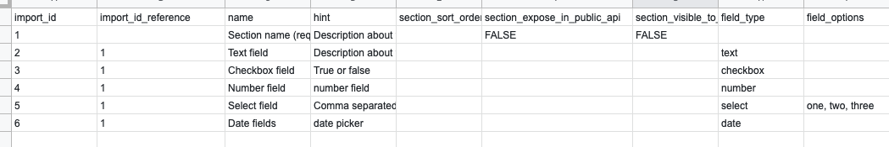

<p align="center">
    <a href="https://outpost-staging.herokuapp.com/">
                       
    </a>
</p>
  
<p align="center">
    <em>Service directories done right</em>         
</p>

---

# 💿 Custom fields

There are two files included in this repository, [custom-fields-template--with-sample-data.csv](./custom-fields-template--with-sample-data.csv) and [custom-fields-template.csv](./custom-fields-template.csv). These files will allow you to run an initial import of your data to Outpost. 

The screenshot below gives a visual example of what your file might look like


* Each row in the document must have a unique numeric ID `import_id`. If this ID is missing the import script will not run.
* The `import_id_reference` field refers to the section that custom field belongs to.
* Each field requires a section.
* `name` - If there are duplicate custom field section names - the script will **continue** and assign all fields to the existing section
* `name` - If there are duplicate custom field names, even under other sections - the script will output an error but continue with import


## 🏠 Data structure

| Field title                                                                                                                       | Data format  | Description  |
|---------------------------------------------------------------------------------------------------------------------------------|---|---|
| `import_id`                                                                                                                       | Int **unique**  | A unique number to reference this custom field section for custom field data  |  
| `import_id_reference`                                                                                                             | Int  |  This field must correspond to the `import_id` of the custom field section you are targetting  |
| `name`                                                                                                                            | String **unique**  |  The name of the section or field |
| hint                                                                                                                     | Text  |  A description or hint about this custom field |
| `section_sort_order`                                                                                                                    | Int  | Set the order for the sections in admin  |
| `section_visible_to_community_users`                                                                                                                             | Bool  | Does this field show for non admin users eg community users?  |
| `field_type`                                                                                                                        | String (see below for options)  | The type of field you are creating  |
| `field_options`                                                                                                                    | Comma separated list  | Which options will be available for this field  |
| 


## Select options


A full list of options will always be available in the [custom_field model](https://github.com/wearefuturegov/outpost/blob/master/app/models/custom_field.rb#L6). 


Currently the accepted field types are:

```
Text
Number
Checkbox
Select
Date
```


# Running the import

You can run the task with:

```
rake import:custom_fields
```

By default, the rake task will look for a file called `custom-fields.csv` in the
`lib/seeds` folder.

You can also import data from a different file location on your file system, by
passing a file path in to the rake task. This is an optional argument.

To do this, replace `<file_path>` with the location of the file you
wish to import data from (make sure to keep the quote marks around the task name):

```
rake 'import:custom_fields[<file_path>]'
```
